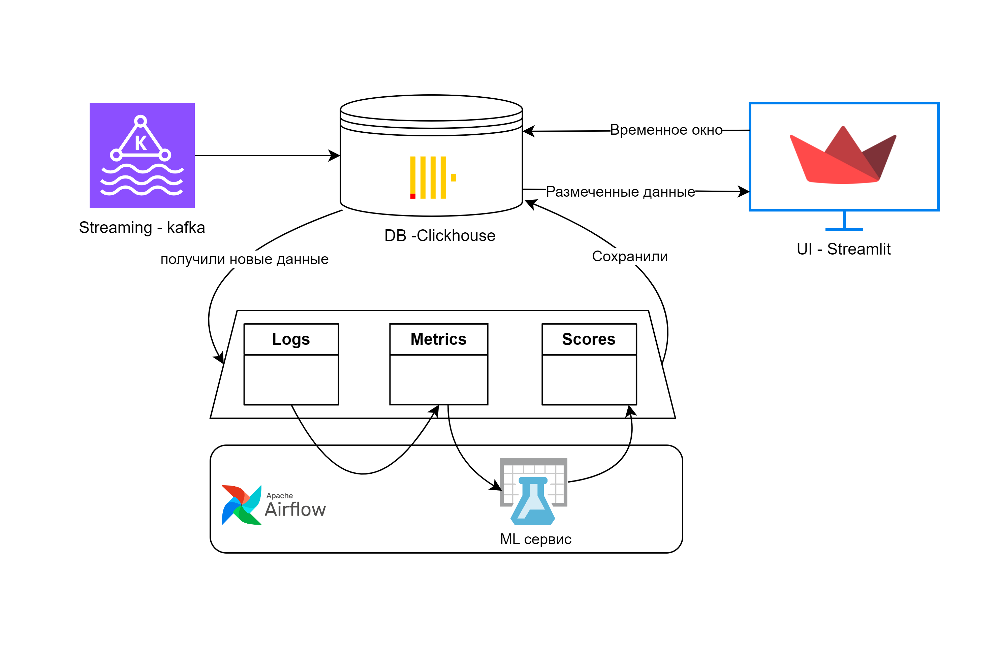

# Команда VZ121
Прототип сервиса по анализу аномалий во временном ряду

# Быстрый старт: 
На сервере должен бысть установлен docker и docker-compose
1) Склонировать репозиторий ```git clone https://github.com/PavelBaboshkin/RedLabHack.git```
2) Перейти в папку созданную под него ```cd <название папки>```
3) Запустить сбор контейнеров ```docker-compose up -d --build```
Через несколько минут сервис будет готов к работе, вся нужная информация выведется в консоли (первая загрузка долгая т.к. скачиваются все нужные данные)
Поднятый сервис будет доступен по адресу указанном в стркое web-1 External URL:

# Техническая реализация: 
Ссылка на сервис - http://188.120.236.93:8501/ 

Архитектура сервиса: 


Точка входа для данных в сервис - брокер сообщений kafka
Оттуда данные забирает clickhouse в таблицу сырых данных logs 
При получении новых данных в таблице logs по тригеру вызвается даг в Airflow, который
1) рассчитывает ключевые метрики в таблицу metrices 
2) тригерит модель, которая скорит новые данные в таблицу probabilities  

Ожидаемое время подготовки данных в этом процессе <= 2 минут
Существующие и записанные в CH данные доступны пользователю для аналитики в любой момент 


